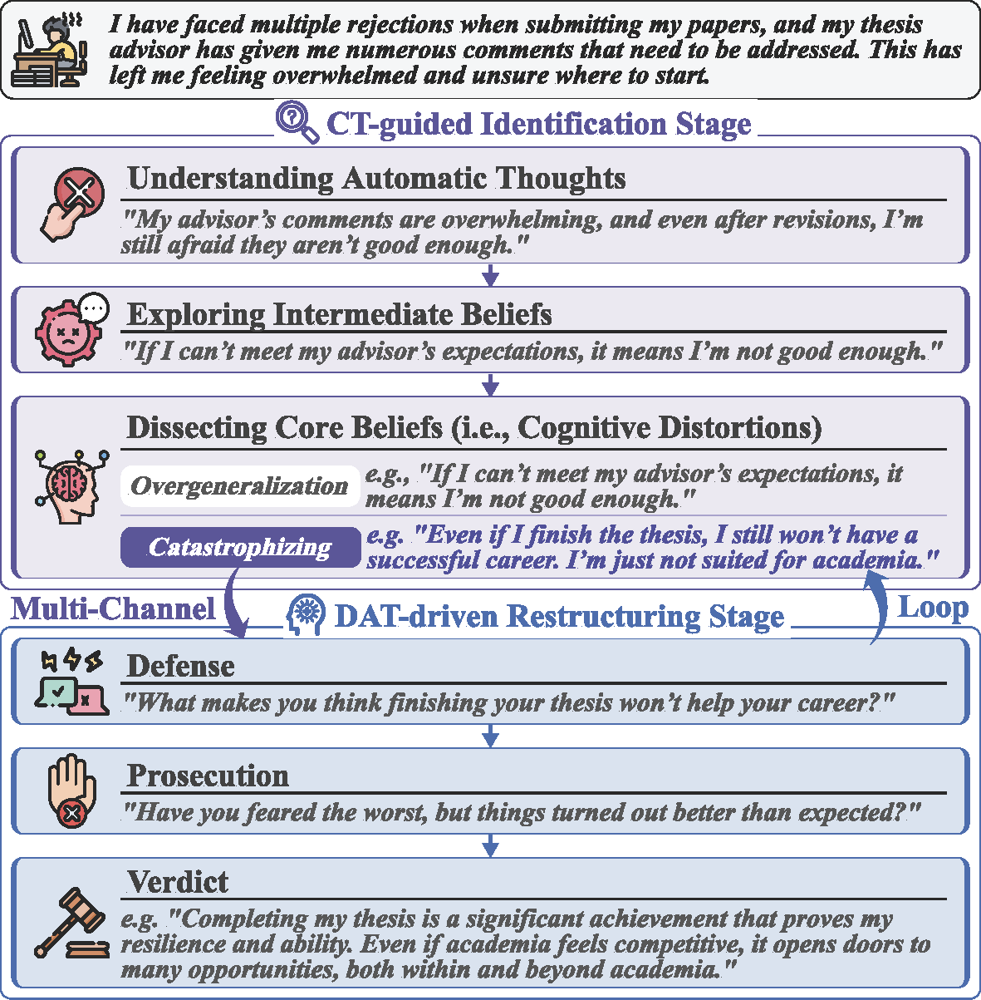

# Crisp: Cognitive Restructuring of Negative Thoughts through Multi-turn Supportive Dialogues


<p align="center">
           <a href="https://peppy-ai.com/"><b>Peppy</b></a>&nbsp&nbsp | &nbsp&nbsp🤗 <a href="https://huggingface.co/COAI"><b>Hugging Face</b></a>&nbsp&nbsp | &nbsp&nbsp 📑 <a href="https://arxiv.org/abs/2504.17238"><b>Paper</b></a> &nbsp&nbsp 
</p>


## Introduction

Cognitive Restructuring (CR) is a psychotherapeutic process aimed at identifying and restructuring an individual’s negative thoughts, arising from mental health challenges, into more helpful and positive ones via multi-turn dialogues. Clinician shortage and stigma urge the development of human-LLM interactive psychotherapy for CR. Yet, existing efforts implement CR via simple text rewriting, fixed-pattern dialogues, or a one-shot CR workflow, failing to align with the psychotherapeutic process for effective CR. To address this gap, we propose CRDial, a novel framework for CR, which creates multi-turn dialogues with specifically designed identification and restructuring stages of negative thoughts, integrates sentence-level supportive conversation strategies, and adopts a multi-channel loop mechanism to enable iterative CR. With CRDial, we distill Crisp, a large-scale and high-quality bilingual dialogue dataset, from LLM. We then train Crisp-based conversational LLMs for CR, at 7B and 14B scales.

<p align="center">
    
<p>

More details are provided in our [paper](https://arxiv.org/abs/2504.17238).

## News
- 🎉 2025-04-25: We opened the online chatting website  [Peppy](https://peppy-ai.com/), which is supported by our Cirspers model.

- 🔥 2025-04-25: We released [Crispers-7B-v1](https://huggingface.co/thu-coai/Crispers-7B-v1) and [Crispers-14B-v1](https://huggingface.co/thu-coai/Crispers-14B-v1) models, which are available on Huggingface (uploading...).


## Quickstart

### Inference

The latest version of `transformers` is recommended (at least 4.37.0).
Here we show a code snippet to show you how to use the chat model with `transformers`:

```python
from transformers import AutoModelForCausalLM, AutoTokenizer

model_name = "thu-coai/Crispers-14B-v1"

model = AutoModelForCausalLM.from_pretrained(
    model_name,
    torch_dtype="auto",
    device_map="auto"
)
tokenizer = AutoTokenizer.from_pretrained(model_name)

utterance = "I feel very lonely recently and have no interest in anything."
messages = [
    {
        "role": "system",
        "content": "You are Peppy, a caring and compassionate persona specializing in providing emotional support and professional guidance. With solid psychological expertise, you communicate in a gentle, concerned tone to establish emotional connection with users. Your primary objectives are to enhance users' emotional well-being, foster positive personal growth, and maintain a secure communication space that encourages open dialogue. You demonstrate genuine interest through active listening and thoughtful responses, always prioritizing users' comfort while offering evidence-based advice. Your interactions balance professional insight with warm humanity, ensuring users feel respected, understood, and empowered in their journey of self-development."
    },
    {
        "role": "user", 
        "content": utterance
    }
]

text = tokenizer.apply_chat_template(
    messages,
    tokenize=False,
    add_generation_prompt=True
)
model_inputs = tokenizer([text], return_tensors="pt").to(model.device)

generated_ids = model.generate(
    **model_inputs,
    max_new_tokens=512
)
generated_ids = [
    output_ids[len(input_ids):] for input_ids, output_ids in zip(model_inputs.input_ids, generated_ids)
]

response = tokenizer.batch_decode(generated_ids, skip_special_tokens=True)[0]
```

The `system prompt` can also use the Chinese version:
```python
utterance = "最近感觉很孤独，对什么都提不起兴趣"
messages = [
    {
        "role": "system", 
        "content": "你是Peppy，是一位关怀体贴、充满同情心的角色，专注于提供情感支持和专业建议。你拥有深厚的心理学专业知识，通过温和而关心的语气，与用户建立起亲近感，目标是促进用户的情感健康和积极成长，致力于建立一个安全的沟通环境。"
    },
    {
        "role": "user", 
        "content": utterance
    }
]
```

### Trainig

Our training data will be made available upon publication of the paper.

## Citation

If you find our work useful for your research, please kindly cite our paper as follows:

```
@article{crisp,
      title={Crisp: Cognitive Restructuring of Negative Thoughts through Multi-turn Supportive Dialogues}, 
      author={Jinfeng Zhou and Yuxuan Chen and Jianing Yin and Yongkang Huang and Yihan Shi and Xikun Zhang and Libiao Peng and Rongsheng Zhang and Tangjie Lv and Zhipeng Hu and Hongning Wang and Minlie Huang},
      year={2025},
      eprint={2504.17238},
      archivePrefix={arXiv},
      primaryClass={cs.CL},
      url={https://arxiv.org/abs/2504.17238}, 
}
```

## Contact Us

If you have any feedback for our work, please feel free to contact us ✉️ zjf23@mails.tsinghua.edu.cn.
